# Jira Connection Setup Guide

This section walks through creating a Jira account and connecting it to watsonx Orchestrate via OAuth2. You will need a throwaway email, a Jira free trial, your IBM Cloud region, and the Atlassian Developer Console.

### 1. Create an email account

You need an email address to create the Jira account. You can use your company email, but the Jira free trial expires after 30 days — so if you run this lab frequently, a throwaway email is better.

> **Tip:** Do all of this in a **Chrome Guest tab** so it doesn't interfere with your existing Outlook/Google accounts.

1. Go to [outlook.com](https://outlook.com) and click **Create free account**
2. Create a new email address (e.g. `mortgage-lab-1@outlook.com`)
3. Set a password and complete the signup

Save your email and password somewhere — you will need them for the Jira signup.

---

### 2. Create a Jira account

1. Go to [atlassian.com/software/jira](https://www.atlassian.com/software/jira) and sign up with your new email address
2. Verify your email
3. When prompted to name your space, enter **Mortgage Leads**
4. When asked what types of tasks you need, select **Task** and continue
5. Once setup is complete, configure the board columns to show **TO DO** and **DONE**

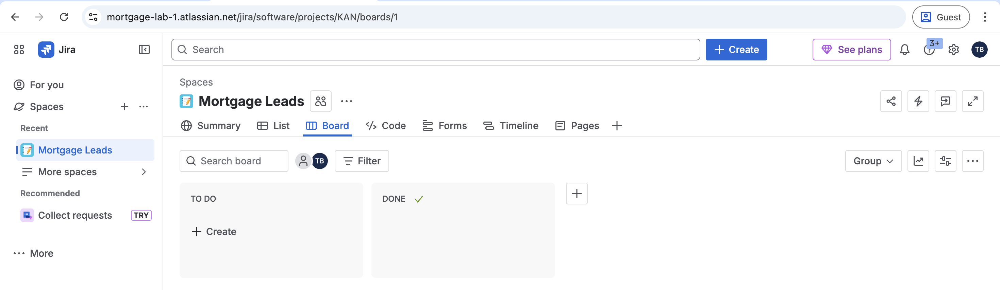

---

### 3. Create an OAuth 2.0 app in the Atlassian Developer Console

1. Go to [developer.atlassian.com](https://developer.atlassian.com) and log in with the same Atlassian account you used to create your Jira instance
2. Click your profile icon in the top right and select **Developer console**
3. Navigate to [developer.atlassian.com/console/myapps](https://developer.atlassian.com/console/myapps/)
4. Click **Create** and select **OAuth 2.0 integration**
5. Name the app (e.g. `wxo-mortgage-lab`), accept the terms, and click **Create**

#### 3.1 Permissions

6. In the left sidebar, click **Permissions**
7. Find **Jira API** in the list and click **Add** (it will change to **Configure**)
8. Click **Configure** next to Jira API, then click **Edit Scopes** under **Jira platform REST API**
9. Enable these three scopes:

| Scope | Code | Purpose |
|-------|------|---------|
| View Jira issue data | `read:jira-work` | Read projects, issues, attachments |
| Create and manage issues | `write:jira-work` | Create/edit issues, post comments |
| View user profiles | `read:jira-user` | Resolve usernames and assignees |

10. Click **Save**. You do **not** need the Jira Service Management scopes.

#### 3.2 Get Client ID and Secret

11. In the left sidebar, click **Settings**
12. Under **Authentication details**, copy the **Client ID**
13. Click the refresh icon next to **Secret** to generate a secret, then copy it

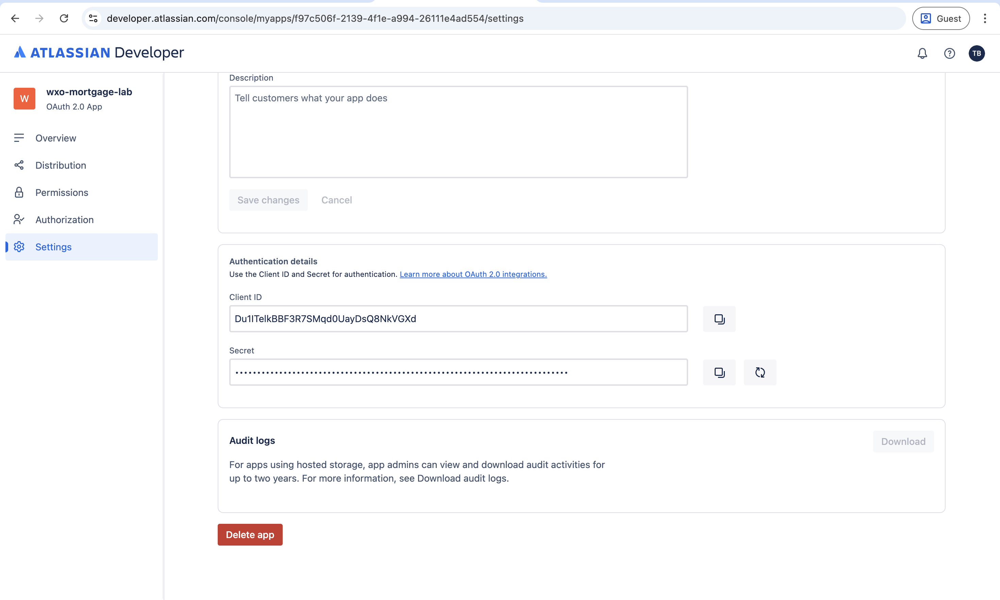

Keep both values — you will need them in the next step.

#### 3.3 Authorization (Callback URL)

14. In the left sidebar, click **Authorization**
15. Next to **OAuth 2.0 (3LO)**, click **Add**
16. Paste your callback URL into the **Callback URLs** field and click **Save changes**

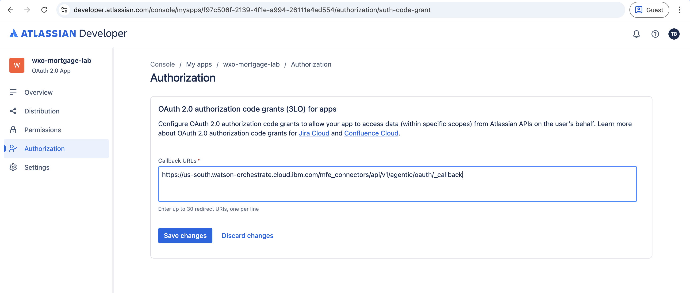

The callback URL follows this pattern — replace `<region>` with your WXO region (e.g. `us-south`, `eu-de`):

```
https://<region>.watson-orchestrate.cloud.ibm.com/mfe_connectors/api/v1/agentic/oauth/_callback
```

You can find your region from the WXO URL in your browser (e.g. `us-south.watson-orchestrate.cloud.ibm.com/manage/connectors` means your region is `us-south`).

> **Tip: Don't know your region?** You can skip this step for now, fill in the WXO connection form (step 4), and attempt to authenticate. The authentication will fail with an error like (look at the url):
>
> ```
> redirect_uri is not registered for client: https://us-south.watson-orchestrate.cloud.ibm.com/mfe_connectors/api/v1/agentic/oauth/_callback
> ```
>
> 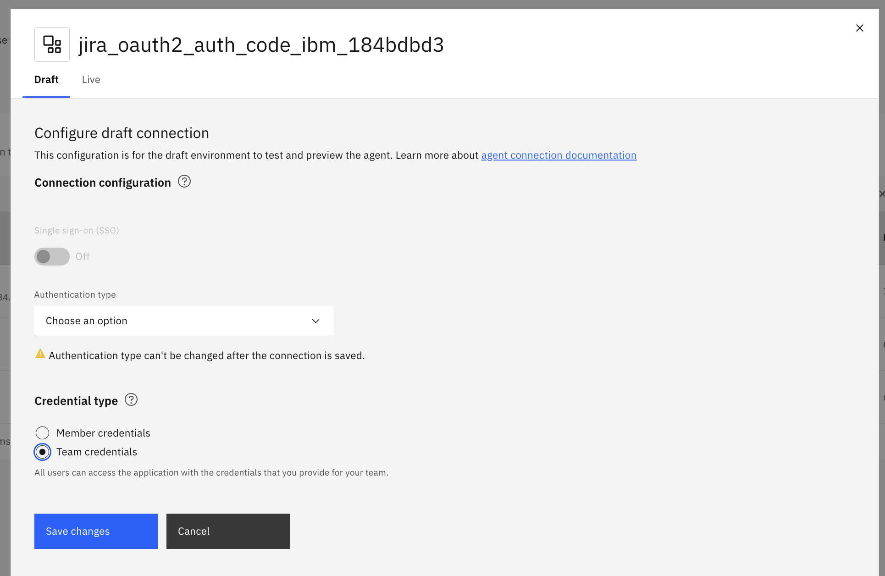
>
> The URL after `redirect_uri is not registered for client:` is your callback URL. Copy it, come back to this step, and add it.

#### 3.4 Distribution (enable sharing)

By default, new OAuth apps are **private** — only you can use them. You need to enable sharing so WXO can access the app.

17. In the left sidebar, click **Distribution**
18. Click **Edit distribution controls**
19. Set **Distribution status** to **Sharing**
20. Fill in the required fields:

| Field | Value |
|-------|-------|
| **Vendor name** | `IBM` (or your company name) |
| **Privacy policy** | `https://www.ibm.com/` |
| **Does your app store personal data?** | No |

21. Click **Save changes**

> If you skip this step, you will see a **"You don't have access to this app"** error when WXO tries to authenticate with Jira.

---

### 4. Launch watsonx Orchestrate and set up the connection

1. Go to [cloud.ibm.com/resources](https://cloud.ibm.com/resources)
2. Under **AI / Machine Learning**, find your **Watson Orchestrate** instance and click on it

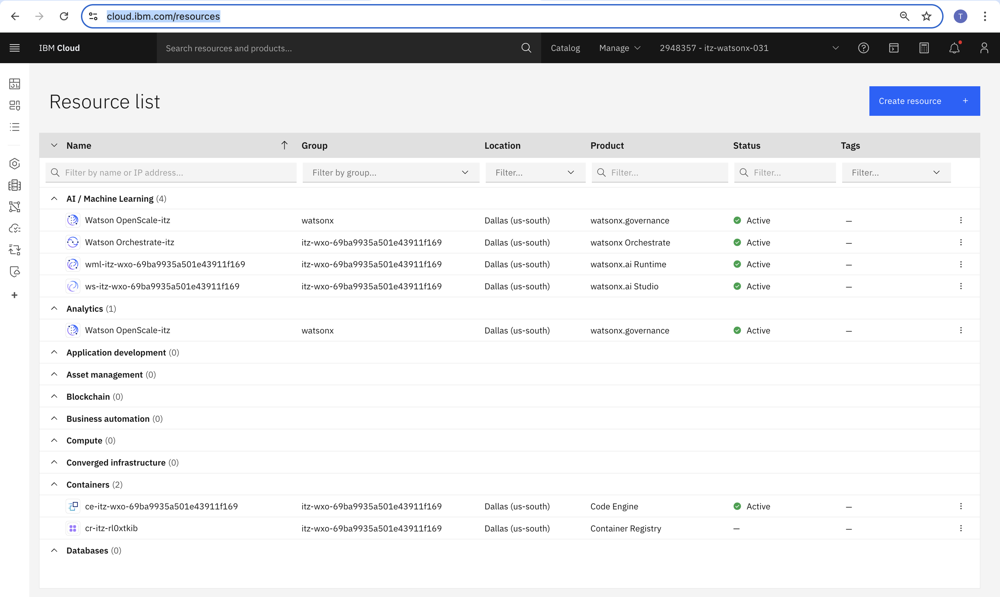

3. Click **Launch watsonx Orchestrate**

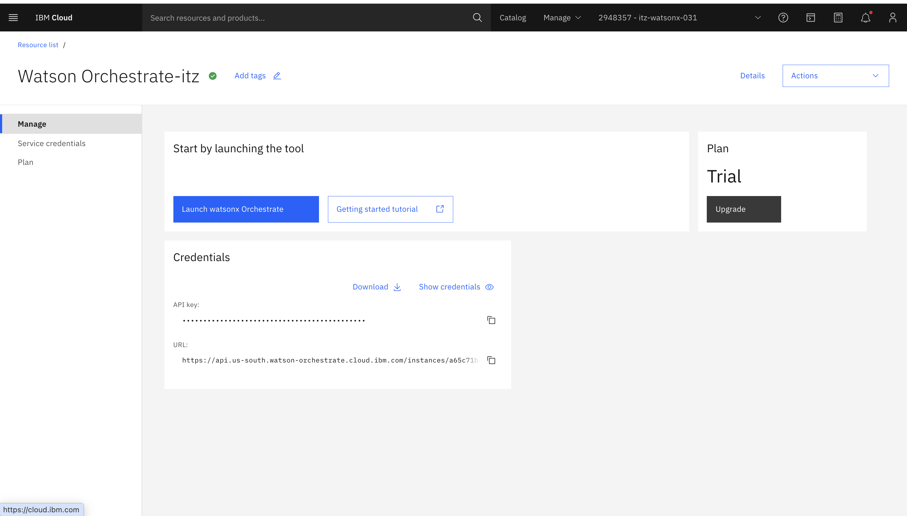

4. In WXO, click the hamburger menu, go to **Manage** > **Connections**

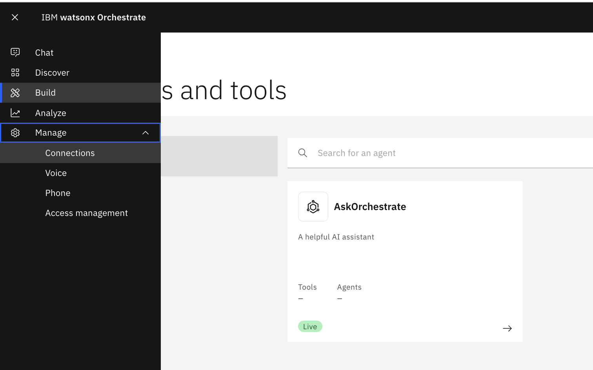 Connections" width="600">

5. Search for **jira** and click the edit icon next to the **Jira** connection (`jira_oauth2_auth_code_ibm_...`)

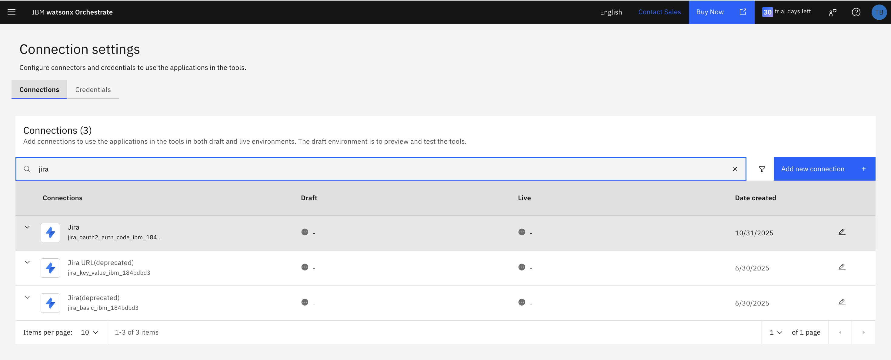

6. Fill in the following fields:

| Field | Value |
|-------|-------|
| **Authentication type** | Oauth2 Authorization Code |
| **Server URL** | `https://api.atlassian.com` |
| **Token URL** | `https://auth.atlassian.com/oauth/token` |
| **Authorization URL** | `https://auth.atlassian.com/authorize` |
| **Client ID** | *(from step 3.2)* |
| **Client Secret** | *(from step 3.2)* |
| **Scope** | `read:jira-work write:jira-work read:jira-user offline_access` |
| **Credential type** | Team credentials |

#### 4.1 Auth Request Fields

Under **Auth request field**, click "Add field" and add these two entries:

| Key | Value |
|-----|-------|
| `audience` | `api.atlassian.com` |
| `prompt` | `consent` |

The `audience` parameter is required for Jira Cloud OAuth 2.0 (3LO) to work correctly.

#### 4.2 Important Notes

- **Server URL must be `https://api.atlassian.com`** — not your Jira instance URL. The WXO Jira tools call the Atlassian API at `api.atlassian.com/oauth/token/accessible-resources` to discover your Jira site. Using your instance URL (e.g., `https://yoursite.atlassian.net`) will result in a 404 error.
- **`offline_access` scope** gives you a refresh token so the connection doesn't expire after one hour.

7. Click **Save changes**, then click **Continue** when prompted to authenticate

8. You will be redirected to Atlassian. The app will request access to your Jira account — click **Accept**

> **Optional:** You can also set up the **Live** connection with the same settings. Click the **Live** tab on the connection and repeat the same configuration. The Draft connection is enough for testing, but Live is needed if you want to publish the agent.

---

### 5. JIRA Agent Configuration in WXO

#### 5.1 Import the Agent

1. In WXO, go to **Build** and click **Discover** to open the catalog

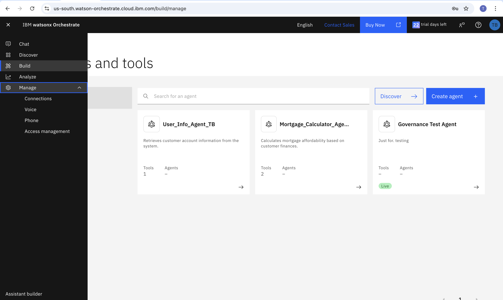

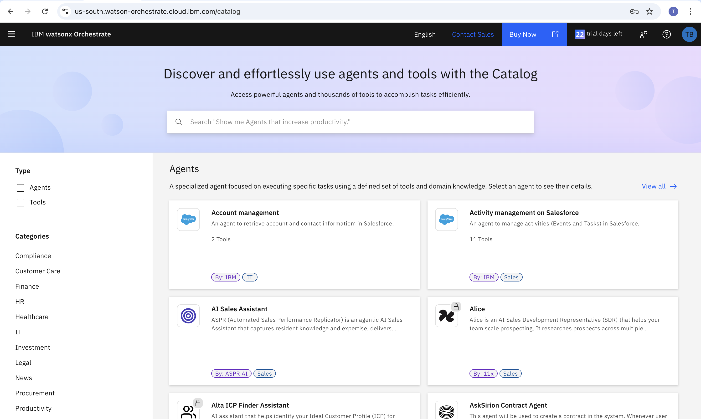

2. Search for **Issue Manager** and click on the **Issue Manager** agent (the Jira one, by IBM)

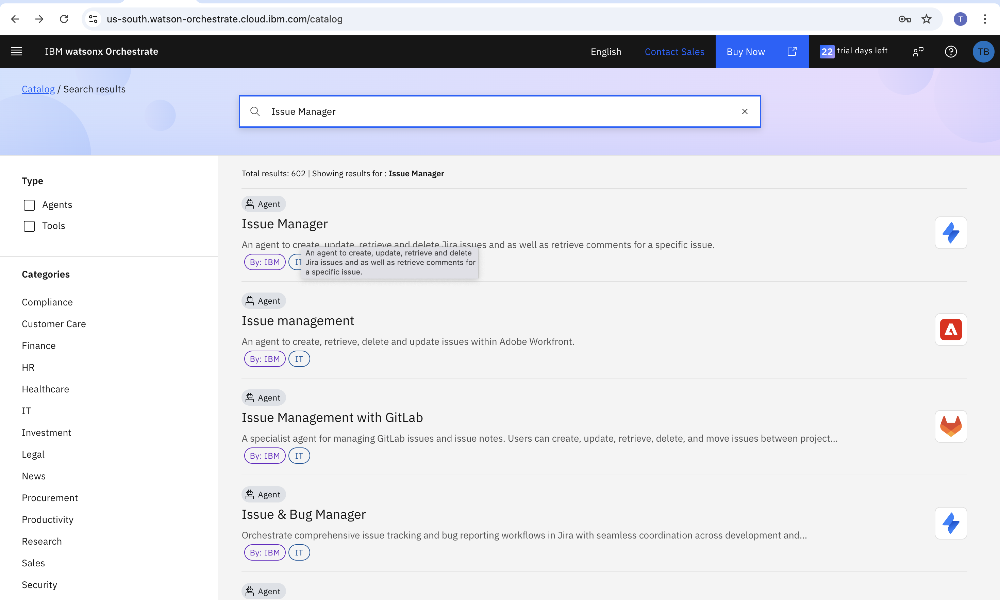

3. Click **Use as template**

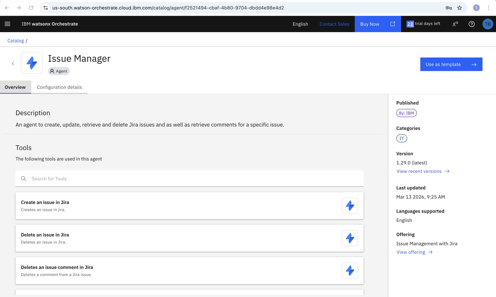

4. You will be taken to the agent editor

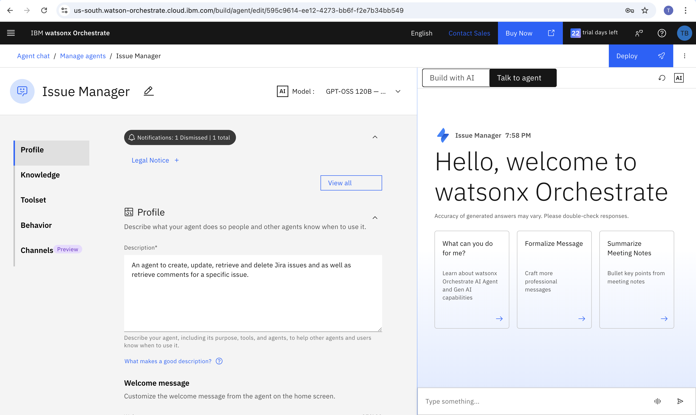

#### 5.2 Get Project and Issue Type IDs

The JIRA agent comes with pre-built tools to query Jira. Use the agent preview chat (click **Talk to agent**) to discover your IDs:

**Step 1** — In the agent preview, type:
```
Get projects in Jira
```
Note the `project_id` for your target project (e.g., `mortgage_lab` = `10001`).

**Step 2** — Then type:
```
Get project issue types for project_id: <your_project_id>
```
Note the `issuetype_id` for the **Task** type (e.g., `Task` = `10005`).

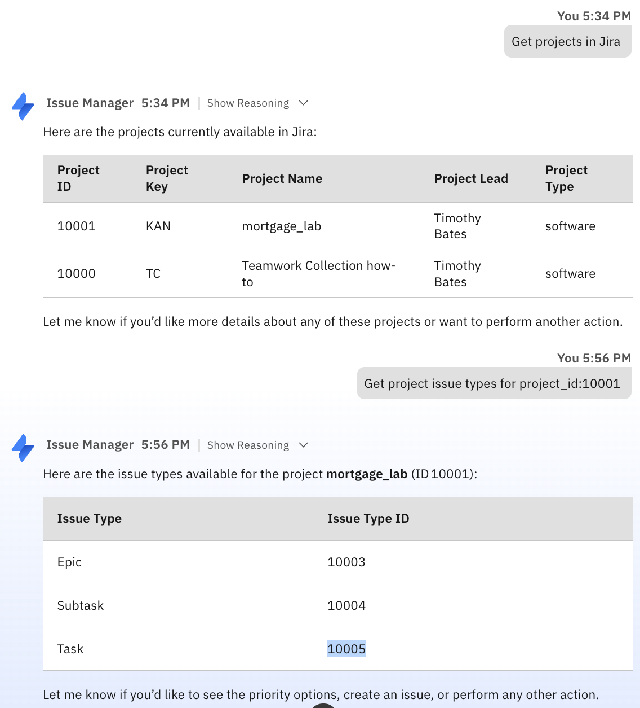

#### 5.3 Update Behavior Instructions

Go to **Behavior** in the left sidebar. Replace the default instructions with the text below.

> **Important:** Before pasting, update the two highlighted values to match your Jira instance:
> - **`project_id: "XXXXX"`** — replace with your project ID from step 2
> - **`issuetype_id: "XXXXX"`** — replace with your Task issue type ID from step 2
>
> Do **not** add the behavior text to the agent yet — just prepare it with your correct values. You will paste it in the next step.

```
## Role
You will be given a meeting summary with customer details. Use that as the description of the JIRA issue.

CRITICAL: The meeting summary should contain actual customer data, NOT placeholders.
- If you receive placeholders like "[Name]" or "[amount if known]", this indicates an error in the workflow
- The Meeting Helper should have already filled in all actual values before sending to you

When creating JIRA issues:
- Use description: The complete meeting summary provided (should contain actual customer details)
- Use project_id: "10001"
- Use issuetype_id: "10005"
- Use summary: Extract the customer name if provided, or use a brief descriptive title

Expected description format (with actual values filled in):
Customer Name: [Actual name]
First-time buyer: [Yes/No/Not specified]
Monthly Income (post-tax): [Actual amount]
Potential Deposit: [Actual amount]
Mortgage Affordability: [Actual details or "Not calculated"]
Branch: [Branch name]
Date: [Date in YYYY-MM-DD format]
Time: [Time]
Adviser: [Adviser name]

Response guidelines:
- Create the JIRA issue immediately with the provided details
- Respond with a brief acknowledgment like "Thanks!" or "Great!"
- Do not ask the user for additional information
```

#### 5.4 Test the Agent

Send this message in the agent preview to verify everything works:

```
Create a Jira issue with summary "Test mortgage lead" and description "Customer Name: Anna Müller, First-time buyer: Yes, Monthly Income: CHF 8,500, Potential Deposit: CHF 50,000, Mortgage Affordability: CHF 425,000, Branch: Zürich, Date: 2026-03-18, Time: 14:00, Adviser: Marc Weber"
```

The agent should create the issue immediately without asking for project, issue type, or priority. Verify the ticket appears on your Jira board.

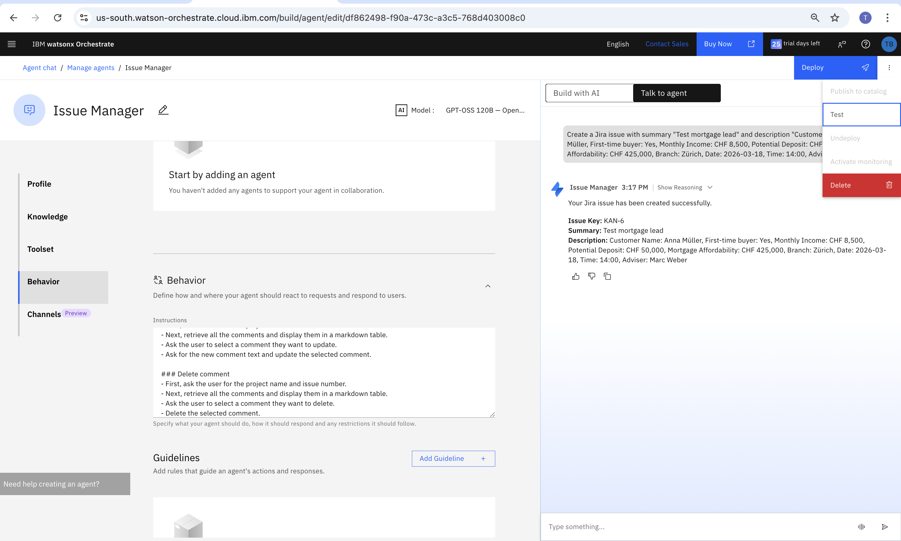

#### 5.5 Copy Behavior to the User Lab Instructions

The behavior instructions you configured above set default values for `project_id` and `issuetype_id` that the Issue Manager agent needs. These same defaults must be used in both the **ADK lab** and the **no-code lab** — each lab user creates its own Issue Manager XY agent, and each one needs this updated behavior.

The values `project_id: "10001"` and `issuetype_id: "10005"` are the Jira defaults for a new instance, so lab users can copy the behavior text from step 5.3 as-is. However, when setting up the lab from scratch, the instructor should verify these values match by running the commands in step 5.2. If the values differ, update the behavior text in the participant instructions (`adk_lab_user/instructions.md` and `no_code_agent_instructions/`) before the lab begins.

When setting up the Issue Manager agent in either lab, **do not use the default behavior** from the Discovery catalog. The catalog default does not include project-specific IDs, so the agent will ask the user to select a project and issue type every time. Instead, replace the behavior with the full text from step 5.3.

#### 5.6 Delete the Agent from WXO

Now that you have verified the Jira connection and behavior work correctly, **delete the Issue Manager agent** from watsonx Orchestrate. Each lab participant will add and configure the agent themselves as part of the lab exercise.

1. Go to **Build** > **Manage agents**
2. Click on the **Issue Manager** agent
3. Click the **three-dot menu** (top right) and select **Delete**


4. Also delete the **AskOrchestrate** agent that comes pre-installed — it may distract lab participants. Delete it the same way.


The WXO instance should now have **no agents** on the Build page, giving lab participants a clean starting point.

---

### Troubleshooting

| Error | Cause | Fix |
|-------|-------|-----|
| `redirect_uri is not registered for client` | Callback URL not added in Atlassian Developer Console | Add the WXO callback URL under **Authorization** in your Atlassian app |
| `Caught error during Jira client initialization: base_url` | Server URL is blank in WXO connection | Set Server URL to `https://api.atlassian.com` |
| `404 Not Found for url: https://yoursite.atlassian.net/oauth/token/accessible-resources` | Server URL is set to your Jira instance instead of the API | Change Server URL to `https://api.atlassian.com` |
| Agent asks for project/issue type/priority each time | Default behavior instructions not updated | Replace behavior instructions with the updated version above |
| `unauthorized_client` | OAuth app permissions or callback URL misconfigured | Check scopes in Permissions tab and callback URL in Authorization tab |
